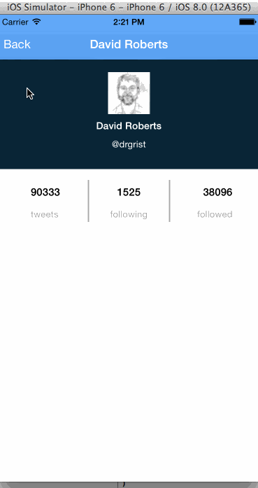

Twitter App
================
## Synopsis

This is the code for the Week 3 Project: Twitter

## Number of hours spent

I spent about 12 hours on doing this project. I think the most time consuming aspect with fooling around with getting the auto layout looking
good

## Features Implemented(required)

* User can sign in using OAuth login flow
* User can view last 20 tweets from their home timeline
* The current signed in user will be persisted across restarts
* In the home timeline, user can view tweet with the user profile picture, username, tweet text, and timestamp. In other words, design the custom cell with the proper Auto Layout settings. You will also need to augment the model classes.
* User can pull to refresh
* User can compose a new tweet by tapping on a compose button.
* User can tap on a tweet to view it, with controls to retweet, favorite, and reply.
* Optional: Replies should be prefixed with the username and the reply_id should be set when posting the tweet

## Installation
The pods directory was also checked in so theoretically should just need to load TwitterApp.xcworkspace

## Third party libraries used

* AFNetworking (for asynchronous loading of images)
* RNActivityView (for showing the loading dialog)
* BDBOAuth1Manager
* NSDateMinimalTimeAgo

## Animated gif walkthrough

